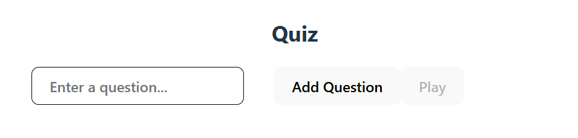
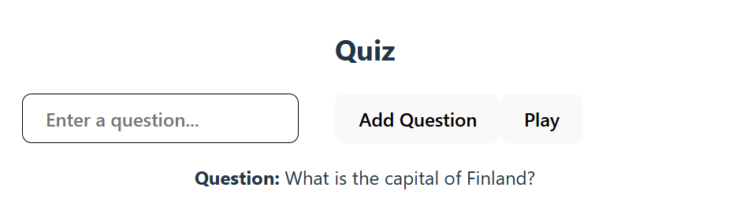

# Simple Quiz
Build a simple React + TypeScript application that allows a user to type in quiz questions and play a random question. 

Step 1. Collect questions
Allow the user to type a question and select its difficulty level: "Easy", "Medium", or "Hard".
- On clicking "Add Question", the question and level should be added to an array in state.
- Clear the form after submission.

Step 2. Play Random Question
- A Play button should be disabled until there are at least 3 questions in the state.
- On clicking the button, show one random question (text + level) from the array state.

The initial view of the application. The Play button is disabled because fewer than three questions have been entered. The user can input a question and select its difficulty level.

The user has entered at least three questions. The Play button is now enabled. After clicking it, a randomly selected question is displayed.

  
